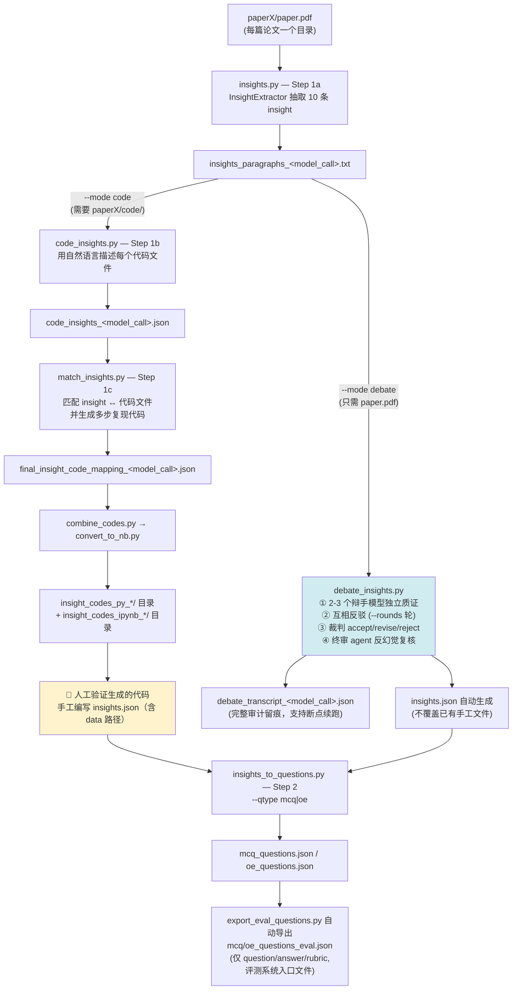
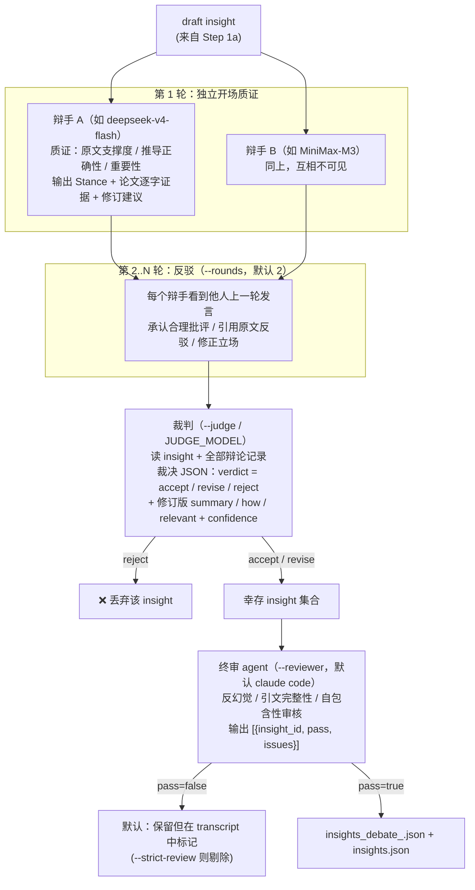
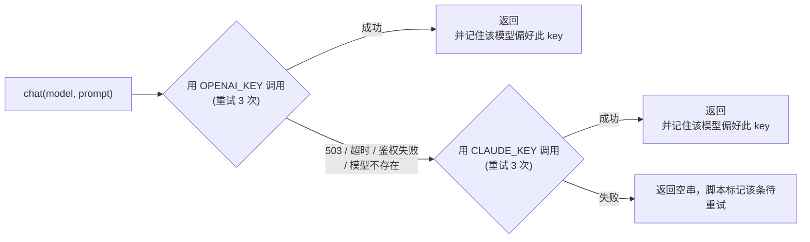

# Benchmark Creation Pipeline — 双模式处理文档

本仓库支持两种 benchmark 创建模式，通过 `run_creation.py --mode` 切换：

| 模式 | 适用论文 | insight 验证方式 |
|---|---|---|
| **code**（默认） | 有开源代码仓库 | 生成可执行的多步代码复现 insight（代码即验证） |
| **debate** | 无代码仓库（如大量湿实验 bio 论文） | 多 LLM 辩论质证 + 裁判裁决 + 终审 agent 复核 |

两种模式共享 **Step 1a（insight 抽取）** 和 **Step 2（出题）**，中间的验证环节不同，最终都产出同一种 schema 的 `insights.json`。

---

## 1. 总体流程图



一条命令跑完整链路（Step 2 出题仍单独执行）：

```bash
python benchmark_creation/run_creation.py --base_dir <dir> --mode code   --model_call claude_code
python benchmark_creation/run_creation.py --base_dir <dir> --mode debate --model_call gateway
```

---

## 2. 输入目录结构

### code 模式

```
base_dir/
  ├─ paper1/
  │   ├─ paper.pdf          # 论文原文
  │   ├─ code/              # 代码仓库（git clone 或手动下载）
  │   │   └─ *.py / *.R / *.pl / *.Rmd / *.ipynb
  │   └─ data/              # 数据文件（.csv / .json / .txt 等）
  └─ paper2/ ...
```

### debate 模式

```
base_dir/
  ├─ paper1/
  │   └─ paper.pdf          # 只需要论文，无需 code/
  └─ paper2/ ...
```

---

## 3. 模式一：code 模式（有代码仓库）

### 3.1 流程图

```mermaid
flowchart LR
    A[paper.pdf] --> B[insights.py<br/>抽取 insight]
    C[code/*.py|.ipynb] --> D[code_insights.py<br/>逐文件自然语言描述]
    B --> E[match_insights.py<br/>1. 为每条 insight 检索相关代码文件<br/>2. 阅读真实源码生成多步复现代码]
    D --> E
    E --> F[combine_codes.py<br/>JSON → 可执行 .py]
    F --> G[convert_to_nb.py<br/>.py → .ipynb]
    G --> H[👤 人工验证<br/>+ 手工编写 insights.json]
```

### 3.2 每步的输入与输出

| 步骤 | 命令 | 输入 | 输出 |
|---|---|---|---|
| 1a 抽取 | `insights.py --base_dir --model_call` | `paper.pdf` | `insights_paragraphs_<mc>.txt` |
| 1b 代码描述 | `code_insights.py --base_dir --model_call` | `code/` 下代码文件 | `code_insights_<mc>.json` |
| 1c 匹配+生成 | `match_insights.py --base_dir --model_call` | 上两者 + `code/` 源码 | `final_insight_code_mapping_<mc>.json` |
| 1d 合并 | `utils/combine_codes.py --base_dir --output_root` | mapping json | `insight_codes_py_<mc>/insight_NN.py` |
| 1e 转笔记本 | `utils/convert_to_nb.py --base_dir` | 上一步 .py | `insight_codes_ipynb_<mc>/insight_NN.ipynb` |
| — 人工验证 | — | notebook 运行结果 | 手工 `insights.json` |
| 2 出题 | `insights_to_questions.py --insight_json_path --qtype` | `insights.json` | `<qtype>_questions.json/.txt` |

### 3.3 关键产物格式

`insights_paragraphs_<mc>.txt`（每篇 10 条，按重要性排序）：

```markdown
**Insight #1**

*Summary:*
MSA Pairformer 尽管只在单链 MSA 上训练，也能泛化到蛋白质相互作用界面预测……

*How it was derived:*
作者在 30 个进化保守的细菌复合物上评估界面接触预测精度……

*Relevant text paragraphs:*
"We present MSA Pairformer, a protein language model that ..."
```

`code_insights_<mc>.json`：

```json
{
  "analysis/load_data.R": "该脚本读取 count 矩阵并构建 Seurat 对象……",
  "notebooks/Fig2.ipynb": "复现 Figure 2 的分析与绘图……"
}
```

`final_insight_code_mapping_<mc>.json`：

```json
{
  "Insight Summary #1": {
    "summary": "……",
    "description": "……（How it was derived 原文）",
    "code_blocks": [
      {
        "code": "<execute>\nimport numpy as np\n...</execute>",
        "reasoning": "该代码块复现 P@K 计算的理由……",
        "derived_from": ["notebooks/Fig2.ipynb"]
      }
    ]
  }
}
```

手工 `insights.json`（code 模式含 `data` 路径映射）：

```json
{
  "paper1": {
    "Insight1": {
      "summary": "……",
      "how": "……",
      "relevant": "论文原文逐字引用……",
      "data": {
        "/abs/path/paper1/code/data/1B70_A_1B70_B.fas": "复合物 1B70 的 paired MSA……"
      }
    }
  }
}
```

---

## 4. 模式二：debate 模式（无代码仓库）

### 4.1 流程图



### 4.2 命令与角色配置

```bash
python benchmark_creation/debate_insights.py \
    --base_dir <dir> \
    --model_call gateway \
    --debaters model_a,model_b \   # 可选，默认取 .env
    --judge model_c \              # 可选
    --reviewer claude_code \       # 可选：网关模型名 | claude_code | none
    --rounds 2 \
    [--strict-review] [--force]
```

角色解析优先级：**CLI 参数 > `.env` 环境变量 > `MODEL_NAME` 推导默认值**

| 角色 | 环境变量 | 缺省推导 |
|---|---|---|
| 辩手（2-3 个，需互不相同） | `DEBATE_MODELS` | `MODEL_NAME` 前两个 |
| 裁判 | `JUDGE_MODEL` | `MODEL_NAME` 最后一个 |
| 终审 | `REVIEW_MODEL` | `claude_code`（本地 agent） |
| Step 1a 抽取模型 | `INSIGHT_MODEL` | `MODEL_NAME` 第一个 |

### 4.3 网关与 key 回退

所有网关调用（辩手 / 裁判 / 网关终审 / `--model_call gateway` 抽取）走 `utils/llm_gateway.py`：



- 两把 key 可以属于网关上不同账号组、各服务不同模型集；粘性偏好保证每个模型只付一次回退延迟。
- `BASE_URL` 自动归一化到 `/v1`；系统代理被绕过（`trust_env=False`）。
- `GATEWAY_TIMEOUT`（秒，默认 600）覆盖每次请求的读超时。默认值适合短输出调用（辩手陈述、
  裁判裁决）；约 14 万字符的整篇论文 prompt **输入本身不慢**（300 token 输出实测 8 秒），
  慢的是长输出（一次生成 ~40 KB 的 insight 抽取会超过 600 秒）。

#### `--drop-methods`（2026-09-17 起）

把论文正文在 `Methods` 标题处截断后再送辩手/终审。实测当前网关时段内，约 14 万字符的
辩论 prompt 只有 MiniMax-M3 能稳定返回（MiniMax-M2.5/M2.7、glm-5.3-flash、qwen3.7-max
全部挂起，claude-opus 系返回 502）；把正文从 135 K 压到 79 K 字符后第二位辩手即可用。
Methods 约占原创论文正文的 42%，对"该 insight 是否被原文支持"的核验最不重要——
论断及其定量支撑都在结果/讨论里。

#### `--tools ""` 与 CLI 环境隔离（2026-09-17 起）

`utils/claude_code_client.py` 现在给 CLI 传 `--tools ""`：CLI 是 agent，在有工具时遇到
"返回严格 JSON"的 prompt 会去**写文件**，stdout 于是变成
`[Tool call: Write]\n{"file_path":…,"content":…}` 而不是答案。另外本机
`~/.claude/settings.json` 启用的插件（superpowers 等）会注入系统提示把模型带偏
（实测输出思考轨迹 + `<tool_call>{"name":"Skill",…}`）；跑出题链路时建议用隔离配置：

```bash
export CLAUDE_CONFIG_DIR=/tmp/claude_iso          # 空目录：不加载插件/设置
export ANTHROPIC_BASE_URL=<网关>
export ANTHROPIC_AUTH_TOKEN=<CLAUDE_KEY>
export CLAUDE_CODE_MODEL=MiniMax-M3
```

### 4.4 输入与输出

| 项 | 说明 |
|---|---|
| 输入 | `paperX/paper.pdf` + `insights_paragraphs_<mc>.txt`（由 Step 1a 生成） |
| 输出 1 | `debate_transcript_<mc>.json` — 完整审计留痕，重跑时已裁决的 insight 自动跳过 |
| 输出 2 | `insights_debate_<mc>.json` — 机器裁决结果 |
| 输出 3 | `insights.json` — 与 code 模式手工版同 schema（无 `data` 字段），已存在时不覆盖（除非 `--force`） |

`debate_transcript_<mc>.json`：

```json
{
  "Insight1": {
    "draft": {"summary": "…", "description": "…", "relevant_text": "…"},
    "rounds": [
      {"round": 1, "statements": {"deepseek-v4-flash": "**Stance:** REVISE…", "MiniMax-M3": "…"}}
    ],
    "judge": {
      "verdict": "revise",
      "summary": "修订后摘要…",
      "how": "修订后推导…",
      "relevant": "论文逐字引用…",
      "rationale": "裁决理由…",
      "confidence": 5
    },
    "review": {"pass": true, "issues": ""}
  }
}
```

debate 模式产出的 `insights.json`：

```json
{
  "paper1": {
    "Insight1": {"summary": "…", "how": "…", "relevant": "…"},
    "Insight3": {"summary": "…", "how": "…", "relevant": "…"}
  }
}
```

（被 reject 或未完成裁决的 insight 不会出现。）

---

## 5. 汇合：Step 2 出题（两种模式相同）

```bash
python benchmark_creation/insights_to_questions.py \
    --insight_json_path <path_to_insights.json> \
    --model_call claude_code \
    --qtype mcq   # 或 oe
```

默认（legacy）模式下，每条 insight 附加一个 `<qtype>_question` 字段，MCQ 含题干 + A-D 选项 + 多选答案（如 `"A,C"`），OE 为开放问题 + 参考答案。产出 `mcq_questions.json` / `oe_questions.json`（及对应 `.txt`），与 `insights.json` 同目录。

### 5.1 结构化出题（`--structured`，推荐）

```bash
python benchmark_creation/insights_to_questions.py \
    --insight_json_path <path_to_insights.json> \
    --model_call claude_code \
    --qtype oe --structured
```

`--per-insight 1`（2026-09-17 起）让每条 insight 只出 1 题。此时没有第二题可以补推理深度，
prompt 会要求唯一那题**必须走高阶题型**（`counterfactual` / `multi_hop`，其次
`causal` / `experimental`），并明确禁止它只是复述 insight 摘要。默认 `2` 保持原行为
（`--per-insight 2` 生成的 prompt 与改动前逐字节一致）。

`--split-calls`（2026-09-17 起）把出题改成**每条 insight 一次 LLM 调用**，而不是整包一次。
整包响应长到会被传输层丢头/丢尾（实测出现过只剩尾部、以及主体完整但丢掉最外层 `]`），
而小 prompt 的解析可靠性明显更高——`difficulty_loop.build_insight_prompt` 早就是按这个
理由逐 insight 调用的，本次把同一策略引入 Step 2。分次调用时答案位置由调用方按
A/B/C/D 轮转指定：模型一次只看到一个 insight，无法在全包范围平衡答案位置，实测不指定
时 10 题里 8 题正确项都落在 B（常量猜 B 即得 80%）。

`--structured` 使用 `prompts/insight2question_rubric_prompts.py`，要求 LLM 返回严格 JSON：每题都是
**Question + Answer + 评分 Rubric** 三件套，由 LLM 基于 Insights 设计：

- **自包含硬性规则**：答题者**只能看到题目本身**（无论文、无数据集、无图表）。所有必要上下文必须以中性事实前提的形式写进题干；题目中禁止出现 "the article/paper/review/study"、"according to"、"as described"、"Figure/Table X" 等任何指向原文的措辞。生成后脚本会用 `SOURCE_LEAK_RE` 自动检测违规题，发现即携带反馈自动重生成一次，保留泄漏更少的版本；仍有残留则打印 WARNING 留给人工清理；
- **题干经济性**：题干 ≤ ~900 字符（~150 词），只保留推理所需前提，砍掉背景铺陈——避免 benchmark 实际测成"长文本抗干扰能力"；
- **题型阶梯**（2026-09-08 起）：每题有唯一 `question_type` 标签，取值固定为
  `extraction / comparison / causal / multi_hop / counterfactual / experimental` 六类；
  每条 insight 的两题按 **Q1=低阶（理解/比较）、Q2=高阶（因果/多跳/反事实，优先后两者）** 分层，
  全集由此形成"基础理解 → 信息整合 → 多步推理 → 反事实/条件变化 → 综合判断"的难度梯度，
  且两题不得互为换词复述。出题与闭环定稿时会打印题型分布与题干长度统计（p50/max）供把关；
- **一题一核心考点**：一题可含多个支撑步骤，但必须围绕唯一 reasoning target——
  禁止"数字提取+原因解释+设计批评+结论复述"混装，保证失败可归因；
- **证据有效性**（2026-09-20 起，`Evidential validity (HARD REQUIREMENT)`）：gold 只能写到证据
  支持的强度。外审曾以 10 题里 9 题"把证据不足的因果结论列为高分必答"判不通过，故新增 8 类禁令：
  跨基线/跨背景百分比运算（含把百分比差当 `pp`）、用 P 值排通路位置、比较不同统计量（F/t/R²/OR）、
  从充分性实验断言必要性/唯一性/`obligatory`、把阴性结合实验当普遍排除、用组成比例（阳性细胞占比）
  反推单细胞产量、混杂操作（载体/盒式/注射）不得归因、反事实只能在证据能识别方向时提问；
  并要求每个定量前提可溯源（原文有，或仅由题干内同基线的量算出）。证据不足时，正确的出题方向是
  "证据能支持什么 / 还需要什么测量才能判定"，而不是造一个确定答案；
- **OE rubric 粒度**：`rubric.facts` **硬性 3–5 条**，语义级核心科学事实（推导产物/机制环节/由数字得出的结论），
  判分为**语义覆盖**（改写/换序/替代推导均算覆盖）——禁止把一个完整结论机械拆成措辞级子点、
  禁止按参考答案粒度复刻；优先"组合前提推出新结论"而非罗列事实（测 reasoning 而非 checklist completion）。
  `rubric.scoring_guide` 为 1-5 分映射；
- **MCQ 选项长度对等**（2026-09-17 起）：四个选项长度需大致相当（最长不超过最短的 ~1.3 倍），
  正确项不得系统性地是最长的那个。此前两个包的正确项平均比干扰项长 ~1.6 倍、且在 19/20 与 9/10
  的题里就是最长项——"选最长的"即可得分，无需推理，很可能正是历史报告里 MCQ 分数压不下来的原因之一；
- **MCQ**：`rubric.correct_reasoning` 解释正确项为何正确，`rubric.distractor_analysis` 逐项解释每个干扰项代表的误读
  （只覆盖**非正确项**：answer 为 `A,C` 时分析 B、D）。

每条 insight 同时挂两个字段：
- `<qtype>_questions`：结构化题目列表（新格式，供人工审核与 rubric 评测使用）；
- `<qtype>_question`：自动渲染的 legacy 文本（`**Question1:** … **Answer1:** …`），保证
  `evaluate_agent_answer.py` / `extract_agent_answer.py` 的正则解析不变即可继续使用。

```json
"Insight1": {
  "summary": "…", "how": "…", "relevant": "…",
  "oe_questions": [
    {"question": "…", "answer": "…",
     "rubric": {"facts": ["F1: …", "F2: …"], "scoring_guide": "…"}}
  ],
  "oe_question": "**Question1:** …\n\n**Answer1:** …"
}
```

JSON 解析失败时不会覆盖已有产物：原始 LLM 输出存入 `<qtype>_questions_raw.txt` 便于排查重试。

出题后按 README 建议做两轮清理：自动过滤强 LLM 能直接答对的简单题，人工剔除幻觉 / 重复 / 未验证部分的题。

### 5.2 出题后处理与校验（`rebalance_mcq_positions.py` / `validate_question_pack.py`）

```bash
# MCQ：确定性地把答案位置重排均匀（改的是位置，不是内容）
python benchmark_creation/rebalance_mcq_positions.py <dir>/mcq_questions.json

# 字段级体检
python benchmark_creation/validate_question_pack.py <dir>/oe_questions_eval.json --qtype oe
python benchmark_creation/validate_question_pack.py <dir>/mcq_questions_eval.json --qtype mcq

# 评测端只应喂这个文件给模型（不含 answer/rubric）
python benchmark_creation/export_eval_questions.py <dir>/oe_questions.json --qtype oe --questions-only
```

**纯 question 导出**（`--questions-only`，2026-09-20 起）：写出
`<qtype>_questions_prompts.json`，每项只有 `question`（MCQ 另含 `options`），
按同一顺序与 `_eval.json` 一一对应。外审要求"确保模型只见 question，不见同文件的
answer/rubric"——eval 文件把三者放在同一对象里，评测端若整份或整条喂给被测模型就会泄题；
给模型的是 `_prompts.json`，判分时按相同下标回 `_eval.json` 取 key。

**`rebalance_mcq_positions.py`**：出题与闭环的重生成都是逐 insight 的，模型看不到全包、
无法在全包范围平衡答案位置，实测三轮之后 10 题里 7 题正确项都落在 B——**常量猜 B 即可拿到
70%**，正好是目标带上限，benchmark 会失去区分度。该脚本按 A/B/C/D 轮转把正确项移到目标槽位，
并同步改写 `answer` / `options` / `distractor_analysis` / rubric 正文里的选项字母引用
（"option B"、"(C)"）与 legacy 文本；题干与选项文本逐字不变（已验证语义等价）。
**建议顺序：出题 → 重排 → 校验 → 闭环 → 再重排 → 再校验。**

**`validate_question_pack.py`** 对导出的 eval 包做体检，退出码即结论（HARD 失败退出 1，WARN 退出 0 但列出）：

| 级别 | 检查 |
|---|---|
| HARD | 字段集（oe: question/answer/rubric；mcq: + options）；`rubric.facts` 3–5 条且非空；`scoring_guide`（oe）；`correct_reasoning` + `distractor_analysis` 恰好覆盖**非正确项**（mcq）；answer 非空；题干无重复 |
| WARN | 题干超 ~900 字符；疑似原文泄漏措辞；两两题干相似度 ≥ `--similarity-warn`（默认 0.40）；**正确项系统性更长**（均值 > 1.25× 干扰项，或过半题目里正确项就是最长项）；**答案位置集中**（单一选项占比 > 40%，随机基线 25%）；**证据有效性**（2026-09-20 新增）：跨背景百分比运算、`pp` 单位误用、跨背景"残余"计算、P 值排序措辞、R² 与 F 混比、`obligatory/unique/唯一 gate` 等过强表述、阴性结果普遍排除、per-cell 产量措辞、载体/共变因素提示 |

后两组（2026-09-17 新增的选项长度/位置，2026-09-20 新增的证据有效性）对应三类
"不推理也能得分 / 推理本身无效"的缺陷。证据有效性检查在实现上做了精度调优：减法算子须紧贴
第一个百分比（避免把"…−28.3% and …−35.2%"这种并列观测误判为相加），并按句识别否定语境
（"does NOT license … obligatory"、"not per-cell production"）加以抑制——**命中集合已与一次
真实外审逐条对齐**（10 题里 9 题命中，且正是外审点名的那 9 题）。建议每次出题/闭环定稿后都跑一遍。

### 5.3 外审驳回后的逐题修复（`repair_reviewed_items.py`）

```bash
python benchmark_creation/repair_reviewed_items.py \
    --questions_json <dir>/oe_questions.json --qtype oe \
    --critiques <dir>/review_critiques.json --model_call claude_code
```

当外部评审点名具体题目时用这个脚本，而不是重跑整包：它把评审对**每一题**的批评逐条注入标准
rubric prompt，要求"保留 insight 与推理层级，但把 key 收敛到证据真正支持的强度"——合法的修法
是让题目限定到该设计能隔离的范围、或询问"还需要什么测量才能判定"（后者往往更难）。
逐题落盘、可断点续跑；`--dry-run <下标>` 可先看组装好的 prompt 而不调用模型；
修复日志落 `repair_log_<qtype>.json`，已修项默认跳过（`--force` 重跑）。
结束时自动重渲染 `.txt` 并重新导出 eval 与纯 question 文件。

### 5.4 难度闭环（`difficulty_loop.py`，推荐的自动清理环节）

把"过滤简单题"自动化为闭环：参考 solver（无原文访问）做题 → MCQ 字母精确匹配 / OE 由 grader 按 rubric facts 打 1-5 分 → **solver 答对（MCQ）或评分 ≥ `--keep-rating`（OE）的题被重新生成得更难**（MCQ 选项为"结论+理由"组合、需组合题干 ≥2 个前提；OE 需多步推导、采分点依赖题干数字组合），已有区分度的题原样保留 → 循环直到整体得分落入目标区间或到达 `--max-rounds`。

**错误集合挖掘（2026-09-06 起）**：每轮判分后，凡某 solver 对某 rubric fact 判为
INCORRECT（直接推翻）或 PARTIAL（只 hedge）的，该 fact 连同 solver 名被逐条注入重生成
prompt 的 "PROVEN solver weak points" 区块，并要求新题的采分点**直接反驳这些已证实的
错误认知**——重复同样错误的 solver 必然 INCORRECT/MISSING，只列可能性不表态的作答最多
PARTIAL。`--solver` 传多个模型（逗号分隔）时自动取**错误并集**，避免只针对单一模型出题。

```bash
# MCQ：目标 exact-match 50%-70%
python benchmark_creation/difficulty_loop.py --qtype mcq \
    --questions_json <dir>/mcq_questions.json --insight_json_path <dir>/insights.json \
    --model_call claude_code --solver MiniMax-M3 --target-min 0.5 --target-max 0.7

# OE：目标均分 2.5-3.5；双 solver 错误并集 + 缓存续跑
python benchmark_creation/difficulty_loop.py --qtype oe \
    --questions_json <dir>/oe_questions.json --insight_json_path <dir>/insights.json \
    --model_call claude_code --solver MiniMax-M3,glm-5.3-flash --grader gpt-5.6-luna \
    --oe-target-min 2.5 --oe-target-max 3.5 \
    --seed_solved "MiniMax-M3=<dir>/oe_solved_minimax.json"
```

- 每轮题目快照存为 `<qtype>_questions_round<N>.json`，**每轮全部 solver 的作答+判分结果**
  落盘为 `<qtype>_solved_round<N>.json`（分数不再只存在于终端）；结束后**最接近目标区间的
  轮次**回写为正式 `<qtype>_questions.json`（含 legacy 文本与 `.txt`）
- `--seed_solved SOLVER=PATH[,SOLVER=PATH...]`：把 `solve_and_grade.py` 的缓存结果直接
  作为第 1 轮成绩（不重做题、不重判分，但计入均分），缓存缺失的题正常做题
- 重新生成的题仍走自包含检查（泄漏原文的题回退上一轮版本）；claude_code 空响应自动重试
- `--per-insight {1,2}`（2026-09-17 起）与出题端同义：题目包里每条 insight 有几题。
  传 1 时加固 prompt 会把"Q1 低阶 / Q2 高阶"那句改成"唯一那题必须保持高阶"，
  并禁止把 `extraction`/`comparison` 写进替换题
- 出题与难度闭环定稿回写后都会**自动导出** `<qtype>_questions_eval.json`（平铺数组，每项仅
  question/answer/rubric，MCQ 另有 options，无任何论文/insight 信息）——**评测系统只应消费此文件**；
  嵌套版保留作溯源审计。手动重生成：`python benchmark_creation/export_eval_questions.py <dir>/oe_questions.json --qtype oe`（格式规范见 `docs/oe_dataset_evaluation_guide.md` §2）
- 单独复测某模型得分可用 `solve_and_grade.py`（不修改题目，只做题+判分，断点续跑）

### 5.5 LAB-Bench 兼容导出与官方评测（`export_labbench.py` / `solve_labbench.py`）

```bash
# 导出：canonical mcq_questions.json → LAB-Bench 官方格式（平铺数组，逐字段一致）
python export_labbench.py --type litqa2 --base_dir <dir1> <dir2> \
    [--source-map "Dir=https://doi.org/10.1038/..."] --check

# 官方评测打分 + 剔除全对简单题
python solve_labbench.py data/labbench/litqa2_bench.json \
    --solver MiniMax-M3,deepseek-v4-flash --drop-all-correct
```

- `--type {litqa2,protocolqa}` 是统一入口超参数；**protocolqa 为预留接口**（调用即报未实现，
  待 Nature Protocols 文章到位后补：Step-N 引用题风 + `protocol` 字段导出）。
- **字段映射**（canonical MCQ → LAB-Bench LitQA2）：`options[answer]` → `ideal`，其余选项 →
  `distractors`；insight 的 `relevant`（论文逐字引用）→ `key-passage`；DOI 由 paper.pdf 与
  目录内 `s43587-*.pdf` **哈希比对**自动推导（Aging 目录里有别人的参考副本，按文件名会认错），
  推不出时用 `--source-map` 指定；`canary` 每次导出生成新 GUID（格式同官方，不复用其 uuid）。
- 多选题（answer 含逗号）、非 ABCD 选项、答案字母缺失 → 跳过并计数。sidecar
  `<out>_eval.json` 与 bench 同下标对齐，存每题字母顺序+答案字母——LAB-Bench 格式本身不带
  字母，官方评测的字母由呈现顺序决定，solver 靠 sidecar 复现。
- **官方打分**复刻 lab-bench CI（`promptfooconfig.yaml` + `.github/assert.py`）：prompt 为
  `Q: {question}\n\nOptions:\nA) ...\n...\nE) unsure\n\nAnswer:`；答案解析优先匹配 `([A-Z])\)`
  （DOTALL），回退取首词首字符；打分三档：字母==ideal → **1.0 Correct**、==unsure（E）→
  **0.1 Unsure**、否则 **0.0 Incorrect**。闭卷作答（题干自包含，与难度闭环 solver 同口径）。
- **格式修复**：官方 prompt 要裸字母，模型若答 `**Answer: C**` 这类 markdown，官方解析器会
  取首字符 `*` 判 0（形式缺陷，非知识缺陷）。解析不出合法选项字母时，脚本携带原答案追问一次
  "只回一个字母"，再用**同一个官方解析器/判分**复核。两条分数都留档：`score_strict`
  （原始回复，等于官方 CI 会得到的分数）与 `score`（修复后，用于简单题判定）。
- **简单题剔除**：所有 solver 都得 1.0 的题即官方口径下的简单题，`--drop-all-correct` 从 bench
  与 sidecar 中剔除，产出 `<bench>_filtered.json`；每 solver 结果缓存于
  `labbench_solved_<model>.json`（按题下标断点续跑，保留 raw 便于核查解析失败）。

### 5.6 文献回忆风出题（`--style litqa_recall`）

```bash
python insights_to_questions.py --insight_json_path <dir>/insights.json \
    --model_call gateway --qtype mcq --structured --per-insight 1 --split-calls \
    --style litqa_recall
```

`--style` 选择出题的设计规则，默认 `self_contained`（原行为，前提全内嵌题干）：
`litqa_recall` 走 `prompts/insight2question_rubric_prompts.py` 的 `_MCQ_RECALL_TEMPLATE`，
题干只给最小限定场景（物种/细胞/处理），直接问论文报道的具体结果（数值/命名实体/方向），
**故意不内嵌前提**——即官方 LitQA2 的形态，答对要求读过（或检索到）这篇论文。仅支持 `--qtype mcq`。

实测（`reports/2026-09-22-litqa2-labbench-export.md` §5）：同一 solver（MiniMax-M3）官方评分
——自包含题 0.939、recall 风 0.060、官方原题 0.294。两种风格构成难度双峰：自包含太易（上下文
推理），recall 对训练截止后的论文过难（闭卷原理上不可答，模型只能认输/猜）。recall 风适合
**带检索的 agent 评测**（官方设计意图）；闭卷评测请用候选池 + solver 实测筛选题的办法。

### 5.7 候选池扩产 + 官方评测筛选（把题包拉到官方档位）

自包含风格的难度天花板：约 90% 的题对强 solver 偏易，扩产不会改变这个比例。有效做法是
**多轮生成候选池 → 官方评测实测 → 剔除简单题**（拒绝采样），而不是试图把单篇的题改难。

```bash
# 1) 每条 insight 出 2 题、重复 3 个独立轮次（写到独立的运行目录，避免互相覆盖）
for r in 1 2 3; do python insights_to_questions.py --insight_json_path pool/<Paper>-r$r/insights.json \
    --model_call gateway --qtype mcq --structured --per-insight 2 --split-calls; done
# 2) 答案位置重排（池模式不做 prompt 内位置指令，靠脚本确定性重排）
python rebalance_mcq_positions.py pool/<Paper>-r1/mcq_questions.json
# 3) 合并导出（--base_dir 传全部运行目录）
python export_labbench.py --type litqa2 --base_dir pool/*/ --out data/labbench/litqa2_pool.json --check
# 4) 官方评测 + 剔除简单题（--keep-band 保留面板均分落在区间内的题，即"官方档位"子集）
python solve_labbench.py data/labbench/litqa2_pool.json --solver MiniMax-M3 --drop-all-correct
python solve_labbench.py data/labbench/litqa2_pool.json --solver A,B --keep-band 0.45 0.55 --band-suffix official
```

实测数据（3 篇论文 × 10 条 insight × 3 轮 = 180 候选）：池上 MiniMax-M3 官方均分 **0.906**；
剔除它答对的题后剩 **17 题**（存活率 9.4%），这 17 题的官方复核得分 **0.235–0.300**（两次重测），
与 M3 在官方 LitQA2 原题上的 **0.294** 重合——即该子集已处于官方档位。两次重测逐题一致率
82.4%，说明单次采样的对/错有噪声，"剔除全对"会天然保留一部分中等难度题（正是想要的效果）。

注意事项：
- `--per-insight` 允许 3..8（候选池 prompt，一次调用出 N 题并要求难度跨度），**但单次输出超过
  约 20KB 会被传输层截尾**（实测 6 题/次触发损坏）；稳妥做法是小批次多轮（2 题/次 × 多轮）。
- `generate_checked` 现对解析失败的调用**自动重试**（默认 3 次），单次截断不再中止整篇。
- 池模式不做 prompt 内答案位置指令（一次调用多题时单一位置会冲突），统一由
  `rebalance_mcq_positions.py` 重排。

---

## 6. 产物链一览

```
paper.pdf
 └─ insights_paragraphs_<mc>.txt                  (两种模式共用, Step 1a)
     ├─ [code]    code_insights_<mc>.json
     │             └─ final_insight_code_mapping_<mc>.json
     │                 └─ insight_codes_py_<mc>/insight_NN.py
     │                     └─ insight_codes_ipynb_<mc>/insight_NN.ipynb
     │                         └─ 👤 insights.json (手工, 含 data)
     └─ [debate]  debate_transcript_<mc>.json
                   └─ insights_debate_<mc>.json
                       └─ insights.json (自动, 不覆盖手工版)
                           └─ mcq_questions.json / oe_questions.json   (Step 2)
                               └─ mcq/oe_questions_eval.json          (自动导出, 评测系统入口:
                                                                    平铺数组, 每项仅 question/answer/
                                                                    rubric (MCQ 另有 options), 无任何
                                                                    论文/insight 信息; 顺序即题目 id)
```
