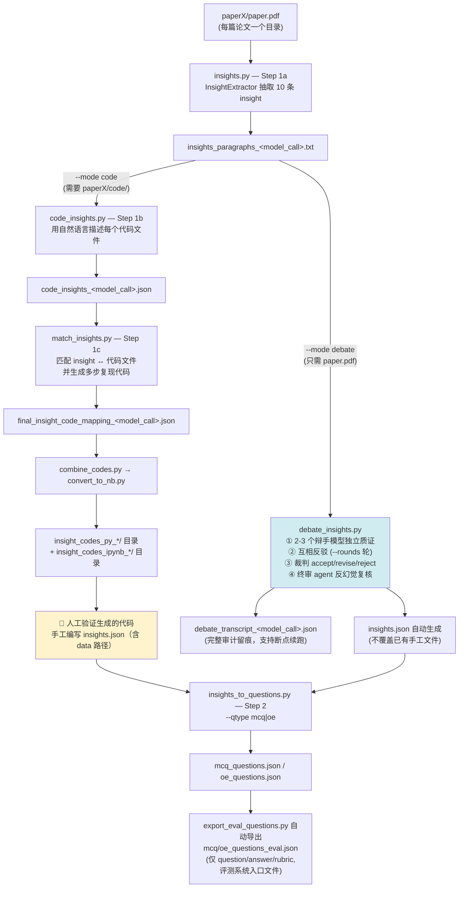
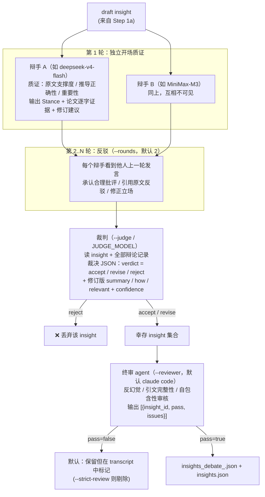
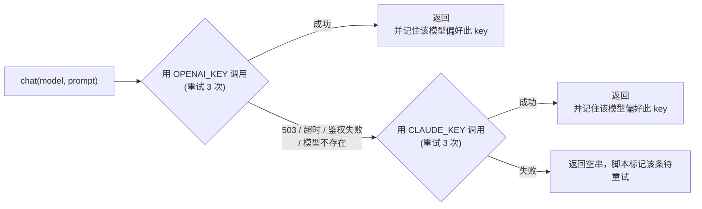

# Benchmark Creation Pipeline — 双模式处理文档

本仓库支持两种 benchmark 创建模式，通过 `run_creation.py --mode` 切换：

| 模式 | 适用论文 | insight 验证方式 |
|---|---|---|
| **code**（默认） | 有开源代码仓库 | 生成可执行的多步代码复现 insight（代码即验证） |
| **debate** | 无代码仓库（如大量湿实验 bio 论文） | 多 LLM 辩论质证 + 裁判裁决 + 终审 agent 复核 |

两种模式共享 **Step 1a（insight 抽取）** 和 **Step 2（出题）**，中间的验证环节不同，最终都产出同一种 schema 的 `insights.json`。

---

## 1. 总体流程图



一条命令跑完整链路（Step 2 出题仍单独执行）：

```bash
python benchmark_creation/run_creation.py --base_dir <dir> --mode code   --model_call claude_code
python benchmark_creation/run_creation.py --base_dir <dir> --mode debate --model_call gateway
```

---

## 2. 输入目录结构

### code 模式

```
base_dir/
  ├─ paper1/
  │   ├─ paper.pdf          # 论文原文
  │   ├─ code/              # 代码仓库（git clone 或手动下载）
  │   │   └─ *.py / *.R / *.pl / *.Rmd / *.ipynb
  │   └─ data/              # 数据文件（.csv / .json / .txt 等）
  └─ paper2/ ...
```

### debate 模式

```
base_dir/
  ├─ paper1/
  │   └─ paper.pdf          # 只需要论文，无需 code/
  └─ paper2/ ...
```

---

## 3. 模式一：code 模式（有代码仓库）

### 3.1 流程图

```mermaid
flowchart LR
    A[paper.pdf] --> B[insights.py<br/>抽取 insight]
    C[code/*.py|.ipynb] --> D[code_insights.py<br/>逐文件自然语言描述]
    B --> E[match_insights.py<br/>1. 为每条 insight 检索相关代码文件<br/>2. 阅读真实源码生成多步复现代码]
    D --> E
    E --> F[combine_codes.py<br/>JSON → 可执行 .py]
    F --> G[convert_to_nb.py<br/>.py → .ipynb]
    G --> H[👤 人工验证<br/>+ 手工编写 insights.json]
```

### 3.2 每步的输入与输出

| 步骤 | 命令 | 输入 | 输出 |
|---|---|---|---|
| 1a 抽取 | `insights.py --base_dir --model_call` | `paper.pdf` | `insights_paragraphs_<mc>.txt` |
| 1b 代码描述 | `code_insights.py --base_dir --model_call` | `code/` 下代码文件 | `code_insights_<mc>.json` |
| 1c 匹配+生成 | `match_insights.py --base_dir --model_call` | 上两者 + `code/` 源码 | `final_insight_code_mapping_<mc>.json` |
| 1d 合并 | `utils/combine_codes.py --base_dir --output_root` | mapping json | `insight_codes_py_<mc>/insight_NN.py` |
| 1e 转笔记本 | `utils/convert_to_nb.py --base_dir` | 上一步 .py | `insight_codes_ipynb_<mc>/insight_NN.ipynb` |
| — 人工验证 | — | notebook 运行结果 | 手工 `insights.json` |
| 2 出题 | `insights_to_questions.py --insight_json_path --qtype` | `insights.json` | `<qtype>_questions.json/.txt` |

### 3.3 关键产物格式

`insights_paragraphs_<mc>.txt`（每篇 10 条，按重要性排序）：

```markdown
**Insight #1**

*Summary:*
MSA Pairformer 尽管只在单链 MSA 上训练，也能泛化到蛋白质相互作用界面预测……

*How it was derived:*
作者在 30 个进化保守的细菌复合物上评估界面接触预测精度……

*Relevant text paragraphs:*
"We present MSA Pairformer, a protein language model that ..."
```

`code_insights_<mc>.json`：

```json
{
  "analysis/load_data.R": "该脚本读取 count 矩阵并构建 Seurat 对象……",
  "notebooks/Fig2.ipynb": "复现 Figure 2 的分析与绘图……"
}
```

`final_insight_code_mapping_<mc>.json`：

```json
{
  "Insight Summary #1": {
    "summary": "……",
    "description": "……（How it was derived 原文）",
    "code_blocks": [
      {
        "code": "<execute>\nimport numpy as np\n...</execute>",
        "reasoning": "该代码块复现 P@K 计算的理由……",
        "derived_from": ["notebooks/Fig2.ipynb"]
      }
    ]
  }
}
```

手工 `insights.json`（code 模式含 `data` 路径映射）：

```json
{
  "paper1": {
    "Insight1": {
      "summary": "……",
      "how": "……",
      "relevant": "论文原文逐字引用……",
      "data": {
        "/abs/path/paper1/code/data/1B70_A_1B70_B.fas": "复合物 1B70 的 paired MSA……"
      }
    }
  }
}
```

---

## 4. 模式二：debate 模式（无代码仓库）

### 4.1 流程图



### 4.2 命令与角色配置

```bash
python benchmark_creation/debate_insights.py \
    --base_dir <dir> \
    --model_call gateway \
    --debaters model_a,model_b \   # 可选，默认取 .env
    --judge model_c \              # 可选
    --reviewer claude_code \       # 可选：网关模型名 | claude_code | none
    --rounds 2 \
    [--strict-review] [--force]
```

角色解析优先级：**CLI 参数 > `.env` 环境变量 > `MODEL_NAME` 推导默认值**

| 角色 | 环境变量 | 缺省推导 |
|---|---|---|
| 辩手（2-3 个，需互不相同） | `DEBATE_MODELS` | `MODEL_NAME` 前两个 |
| 裁判 | `JUDGE_MODEL` | `MODEL_NAME` 最后一个 |
| 终审 | `REVIEW_MODEL` | `claude_code`（本地 agent） |
| Step 1a 抽取模型 | `INSIGHT_MODEL` | `MODEL_NAME` 第一个 |

### 4.3 网关与 key 回退

所有网关调用（辩手 / 裁判 / 网关终审 / `--model_call gateway` 抽取）走 `utils/llm_gateway.py`：



- 两把 key 可以属于网关上不同账号组、各服务不同模型集；粘性偏好保证每个模型只付一次回退延迟。
- `BASE_URL` 自动归一化到 `/v1`；系统代理被绕过（`trust_env=False`）。

### 4.4 输入与输出

| 项 | 说明 |
|---|---|
| 输入 | `paperX/paper.pdf` + `insights_paragraphs_<mc>.txt`（由 Step 1a 生成） |
| 输出 1 | `debate_transcript_<mc>.json` — 完整审计留痕，重跑时已裁决的 insight 自动跳过 |
| 输出 2 | `insights_debate_<mc>.json` — 机器裁决结果 |
| 输出 3 | `insights.json` — 与 code 模式手工版同 schema（无 `data` 字段），已存在时不覆盖（除非 `--force`） |

`debate_transcript_<mc>.json`：

```json
{
  "Insight1": {
    "draft": {"summary": "…", "description": "…", "relevant_text": "…"},
    "rounds": [
      {"round": 1, "statements": {"deepseek-v4-flash": "**Stance:** REVISE…", "MiniMax-M3": "…"}}
    ],
    "judge": {
      "verdict": "revise",
      "summary": "修订后摘要…",
      "how": "修订后推导…",
      "relevant": "论文逐字引用…",
      "rationale": "裁决理由…",
      "confidence": 5
    },
    "review": {"pass": true, "issues": ""}
  }
}
```

debate 模式产出的 `insights.json`：

```json
{
  "paper1": {
    "Insight1": {"summary": "…", "how": "…", "relevant": "…"},
    "Insight3": {"summary": "…", "how": "…", "relevant": "…"}
  }
}
```

（被 reject 或未完成裁决的 insight 不会出现。）

---

## 5. 汇合：Step 2 出题（两种模式相同）

```bash
python benchmark_creation/insights_to_questions.py \
    --insight_json_path <path_to_insights.json> \
    --model_call claude_code \
    --qtype mcq   # 或 oe
```

默认（legacy）模式下，每条 insight 附加一个 `<qtype>_question` 字段，MCQ 含题干 + A-D 选项 + 多选答案（如 `"A,C"`），OE 为开放问题 + 参考答案。产出 `mcq_questions.json` / `oe_questions.json`（及对应 `.txt`），与 `insights.json` 同目录。

### 5.1 结构化出题（`--structured`，推荐）

```bash
python benchmark_creation/insights_to_questions.py \
    --insight_json_path <path_to_insights.json> \
    --model_call claude_code \
    --qtype oe --structured
```

`--structured` 使用 `prompts/insight2question_rubric_prompts.py`，要求 LLM 返回严格 JSON：每题都是
**Question + Answer + 评分 Rubric** 三件套，由 LLM 基于 Insights 设计：

- **自包含硬性规则**：答题者**只能看到题目本身**（无论文、无数据集、无图表）。所有必要上下文必须以中性事实前提的形式写进题干；题目中禁止出现 "the article/paper/review/study"、"according to"、"as described"、"Figure/Table X" 等任何指向原文的措辞。生成后脚本会用 `SOURCE_LEAK_RE` 自动检测违规题，发现即携带反馈自动重生成一次，保留泄漏更少的版本；仍有残留则打印 WARNING 留给人工清理；
- **OE**：`rubric.facts` 为原子评分要点（F1, F2, …，对齐 `geval_prompts` G-Eval 的 PRESENT/PARTIAL/MISSING/INCORRECT 协议），`rubric.scoring_guide` 为 1-5 分映射；
- **MCQ**：`rubric.correct_reasoning` 解释正确项为何正确，`rubric.distractor_analysis` 逐项解释每个干扰项代表的误读。

每条 insight 同时挂两个字段：
- `<qtype>_questions`：结构化题目列表（新格式，供人工审核与 rubric 评测使用）；
- `<qtype>_question`：自动渲染的 legacy 文本（`**Question1:** … **Answer1:** …`），保证
  `evaluate_agent_answer.py` / `extract_agent_answer.py` 的正则解析不变即可继续使用。

```json
"Insight1": {
  "summary": "…", "how": "…", "relevant": "…",
  "oe_questions": [
    {"question": "…", "answer": "…",
     "rubric": {"facts": ["F1: …", "F2: …"], "scoring_guide": "…"}}
  ],
  "oe_question": "**Question1:** …\n\n**Answer1:** …"
}
```

JSON 解析失败时不会覆盖已有产物：原始 LLM 输出存入 `<qtype>_questions_raw.txt` 便于排查重试。

出题后按 README 建议做两轮清理：自动过滤强 LLM 能直接答对的简单题，人工剔除幻觉 / 重复 / 未验证部分的题。

### 5.2 难度闭环（`difficulty_loop.py`，推荐的自动清理环节）

把"过滤简单题"自动化为闭环：参考 solver（无原文访问）做题 → MCQ 字母精确匹配 / OE 由 grader 按 rubric facts 打 1-5 分 → **solver 答对（MCQ）或评分 ≥ `--keep-rating`（OE）的题被重新生成得更难**（MCQ 选项为"结论+理由"组合、需组合题干 ≥2 个前提；OE 需多步推导、采分点依赖题干数字组合），已有区分度的题原样保留 → 循环直到整体得分落入目标区间或到达 `--max-rounds`。

**错误集合挖掘（2026-09-06 起）**：每轮判分后，凡某 solver 对某 rubric fact 判为
INCORRECT（直接推翻）或 PARTIAL（只 hedge）的，该 fact 连同 solver 名被逐条注入重生成
prompt 的 "PROVEN solver weak points" 区块，并要求新题的采分点**直接反驳这些已证实的
错误认知**——重复同样错误的 solver 必然 INCORRECT/MISSING，只列可能性不表态的作答最多
PARTIAL。`--solver` 传多个模型（逗号分隔）时自动取**错误并集**，避免只针对单一模型出题。

```bash
# MCQ：目标 exact-match 50%-70%
python benchmark_creation/difficulty_loop.py --qtype mcq \
    --questions_json <dir>/mcq_questions.json --insight_json_path <dir>/insights.json \
    --model_call claude_code --solver MiniMax-M3 --target-min 0.5 --target-max 0.7

# OE：目标均分 2.5-3.5；双 solver 错误并集 + 缓存续跑
python benchmark_creation/difficulty_loop.py --qtype oe \
    --questions_json <dir>/oe_questions.json --insight_json_path <dir>/insights.json \
    --model_call claude_code --solver MiniMax-M3,glm-5.3-flash --grader gpt-5.6-luna \
    --oe-target-min 2.5 --oe-target-max 3.5 \
    --seed_solved "MiniMax-M3=<dir>/oe_solved_minimax.json"
```

- 每轮题目快照存为 `<qtype>_questions_round<N>.json`，**每轮全部 solver 的作答+判分结果**
  落盘为 `<qtype>_solved_round<N>.json`（分数不再只存在于终端）；结束后**最接近目标区间的
  轮次**回写为正式 `<qtype>_questions.json`（含 legacy 文本与 `.txt`）
- `--seed_solved SOLVER=PATH[,SOLVER=PATH...]`：把 `solve_and_grade.py` 的缓存结果直接
  作为第 1 轮成绩（不重做题、不重判分，但计入均分），缓存缺失的题正常做题
- 重新生成的题仍走自包含检查（泄漏原文的题回退上一轮版本）；claude_code 空响应自动重试
- 出题与难度闭环定稿回写后都会**自动导出** `<qtype>_questions_eval.json`（平铺数组，每项仅
  question/answer/rubric，MCQ 另有 options，无任何论文/insight 信息）——**评测系统只应消费此文件**；
  嵌套版保留作溯源审计。手动重生成：`python benchmark_creation/export_eval_questions.py <dir>/oe_questions.json --qtype oe`（格式规范见 `docs/oe_dataset_evaluation_guide.md` §2）
- 单独复测某模型得分可用 `solve_and_grade.py`（不修改题目，只做题+判分，断点续跑）

---

## 6. 产物链一览

```
paper.pdf
 └─ insights_paragraphs_<mc>.txt                  (两种模式共用, Step 1a)
     ├─ [code]    code_insights_<mc>.json
     │             └─ final_insight_code_mapping_<mc>.json
     │                 └─ insight_codes_py_<mc>/insight_NN.py
     │                     └─ insight_codes_ipynb_<mc>/insight_NN.ipynb
     │                         └─ 👤 insights.json (手工, 含 data)
     └─ [debate]  debate_transcript_<mc>.json
                   └─ insights_debate_<mc>.json
                       └─ insights.json (自动, 不覆盖手工版)
                           └─ mcq_questions.json / oe_questions.json   (Step 2)
                               └─ mcq/oe_questions_eval.json          (自动导出, 评测系统入口:
                                                                    平铺数组, 每项仅 question/answer/
                                                                    rubric (MCQ 另有 options), 无任何
                                                                    论文/insight 信息; 顺序即题目 id)
```
